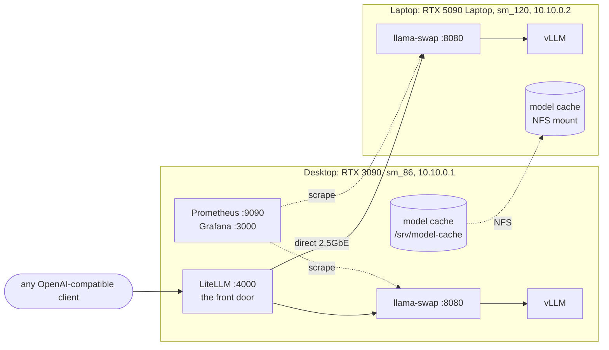

# GPU-Lab

Two consumer GPUs of different architectures, an **RTX 3090 (sm_86)** in a
desktop and an **RTX 5090 Laptop (sm_120)**, run as one lab over a direct
2.5GbE cable. It measures how the same CUDA code behaves on the two
architectures, and it pools both cards into one 48 GB device that serves
models neither card fits alone.

## Highlights

- **A 70B model on two consumer cards.** Pipeline parallelism across the cable
  serves Llama-3.1-70B (4-bit GPTQ) at ~19 tok/s single-stream with 4k context.
  The same pool serves Qwen3-14B at ~2030 tok/s aggregate across 128 concurrent
  requests. See [Pooling both cards](#pooling-both-cards).
- **A cross-architecture kernel differential.** vLLM's own kernel tests run on
  both cards from one bit-identical image. The two cards do not even collect
  the same tests: 72 NVFP4 tests exist only on sm_120, admitted by a numeric
  capability threshold rather than a family check. Candidate upstream reports
  (C1 to C8) are triaged with their evidence in
  [docs/contributions.md](docs/contributions.md); none has been filed yet.
- **A guard against a silent failure.** An image built for the wrong
  architecture does not crash; the driver JIT-compiles embedded PTX and
  returns plausible numbers at the wrong speed. The build states its gencode
  explicitly, and `arch_probe` fails loudly on a mismatch. See
  [below](#the-one-thing-to-understand-before-changing-the-build).
- **One OpenAI-compatible endpoint** in front of both nodes (LiteLLM, then
  llama-swap, then vLLM), with Prometheus and Grafana watching both GPUs.
- **A negative result, kept.** QLoRA on an 8B model learned the *style* of the
  lab's facts but not the facts. The pipeline and its evals are in
  [training/](training/) and [bench/](bench/).
- **sm-differ**, a Rust CLI that compares one metric across the two
  architectures and refuses to give a verdict it cannot support: a missing
  reading is never turned into a number. See [kernels/sm-differ/](kernels/sm-differ/).

## Architecture

A client names a model and LiteLLM routes it to whichever node's llama-swap
holds it; llama-swap starts and stops vLLM on demand. `lab pool up` replaces
that arrangement with one vLLM instance split across both cards (pipeline
parallel over Ray), served on `:8200`.

## Two jobs

**It is a measurement instrument.** Two GPU architectures, one generation and one
power class apart, are held identical in *every respect except the architecture* —
same OS, kernel, driver, CUDA, container runtime, model cache — so that any
measured difference between them is attributable. That constraint is the reason
behind most of the decisions in this repo, and it is why the build is pedantic
about gencode.

**It is a working LLM lab.** Both nodes serve continuously behind one
OpenAI-compatible front door, and the two cards can be pooled into a single 48 GB
device that runs models neither card fits alone — including a 4-bit 70B. This
half did not exist when the README was first written; the lab began as the
instrument alone, and the serving plane was built to keep it useful between
measurement runs.

The two jobs pull against each other, which is worth stating plainly: attribution
wants the cards isolated and identical, pooling wants them fused and busy. They do
not run at the same time. `lab pool up` claims both cards and stops the per-node
servers; `lab pool down` gives them back.

## Nodes

| | Desktop | Laptop |
|---|---|---|
| Host | `davids-llm-server` | `david-Legion-Pro-7-16IAX10H` |
| GPU | RTX 3090, sm_86, 24576 MiB | RTX 5090 Laptop, sm_120, 24463 MiB |
| Power cap | 400 W | 175 W |
| Host RAM | 31.9 GB | 63.4 GB |
| Role | always-on serving + training | source builds + the sm_120 experiment |
| Kernel | 7.0.0-31-generic | 7.0.0-34-generic |
| docker-ce | 29.8.0 | 29.8.1 |
| nvidia-container-toolkit | 1.20.0-1 | 1.20.1-1 |

Both: Ubuntu 26.04.1, driver 595.91.07, CUDA 13.2. The kernel, Docker and
container-toolkit patch versions matched at Phase 0 and have since drifted
apart (checked 2026-09-27). Under the "identical except the architecture"
rule, that drift has to be closed, or ruled out as a cause, before a
difference between the nodes is put down to the architecture.

Connected by a direct 2.5GbE cable on a private /30 (`10.10.0.1` / `10.10.0.2`),
0.55 ms RTT. See [host/](host/).

The link is also the pool's interconnect: ~280 MB/s NCCL, ~0.24 ms per token
crossing, which is why a pipeline-parallel cut between the two cards is viable and
a tensor-parallel one is not. The laptop runs no sshd, so control flows laptop →
desktop only; that is why `lab pool` is driven from the laptop.

## Phases and status

The lab was built in phases against a design document that the code and docs
call *the runbook*; comments cite its sections (§02, §06 and so on). The
runbook itself is private. What each phase built and found is summarized
here, and the detail is in [docs/](docs/).

| Phase | What it built | Status |
|---|---|---|
| 0 | Host foundation: matched OS, driver, CUDA and container runtime on both nodes; the direct link; a shared model cache over NFS; one Dockerfile with two architecture targets. [host/](host/), [arch/](arch/) | Done 2026-09-13 |
| 1 | Serving plane: vLLM behind llama-swap on each node, LiteLLM as the single front door, Prometheus and Grafana, and the first recorded baseline. [docs/phase1-serving-plane.md](docs/phase1-serving-plane.md) | Done 2026-09-13 |
| 2 | Dev plane and kernel differential: the prebuilt vLLM image serves on sm_120 with no source build, and upstream kernel tests run and are compared on both architectures. [docs/phase2-dev-plane.md](docs/phase2-dev-plane.md), [docs/contributions.md](docs/contributions.md) | Done 2026-09-16; candidates triaged 2026-09-18, none filed yet |
| 2b | QLoRA training on the 3090, then a held-out eval of research-assistant adapters. The pipeline works; LoRA taught style, not facts. [training/](training/), [bench/research_eval.py](bench/research_eval.py) | Done 2026-09-17 |
| Pool | Both cards as one 48 GB device through pipeline parallelism, including a 4-bit 70B. [Pooling both cards](#pooling-both-cards) | Working, 70B since 2026-09-20; no systemd unit or auth yet |
| 3 | sm-differ, a Rust CLI for cross-architecture regression diffs that reads its metrics from Prometheus. `diff` and `verdict` are built and tested; the Docker build driver and JUnit ingest are not. [kernels/sm-differ/](kernels/sm-differ/) | In progress (elective) |

## Contents

Organised by what runs where, not by the phase that introduced it. Phases are a
plan axis; they stopped describing the tree the moment a second node appeared and
Phase 2's endpoint had to be configured in Phase 1's files.

    bin/lab           control the serving plane on either node; it is node-aware
    bin/check.py      pre-push validation -- a config must be able to serve before it deploys
    arch/             one image recipe, two architecture targets, and the runtime arch proof
    nodes/            per-node llama-swap config + systemd unit (desktop sm_86, laptop sm_120)
    serving/          LiteLLM (the single front door) + the vLLM/Ray pool image
    monitoring/       Prometheus, Grafana, and the compose stack behind them
    bench/            the benchmark and its recorded baselines, per-node and pooled
    kernels/          the cross-arch kernel differential harness and its C4 repros
    kernels/sm-differ the Phase 3 regression differ (Rust); `cargo test` runs in the push gate
    training/         the QLoRA pipeline (runs on the desktop, sm_86)
    host/             host configuration that is not reproducible from code alone
    docs/             what each phase delivered, and the upstream candidate ledger

## Using it

Everything is driven by `bin/lab`. The same script runs on both nodes and does the
right thing for whichever one it is on:

    lab up      [--warm]     start everything (optionally preload this node's model)
    lab down    [--boot-off] stop everything (optionally also disable autostart)
                [--gpu-only] stop only what holds the GPU; leave the front door up
    lab pool    up|down      one model across BOTH cards (run it from the laptop)
    lab status               what is running, and is the GPU actually free
    lab reload  [svc]        apply edited config files (they are read-only mounts)
    lab check                validate configs before a push deploys them
    lab install              (re)write this node's systemd unit from the repo
    lab logs    <svc>        follow logs (llama-swap|litellm|prometheus|grafana|model|pool)

The front door is LiteLLM on the desktop, OpenAI-compatible:

    http://10.10.0.1:4000/v1

It routes to llama-swap on whichever node holds the requested model, so a client
names a model and never needs to know which card answers. Models are loaded on
demand and swapped out again; the two nodes' catalogues are
[nodes/desktop/llama-swap.yaml](nodes/desktop/llama-swap.yaml) and
[nodes/laptop/llama-swap.yaml](nodes/laptop/llama-swap.yaml).

The front door is co-located with the training card, which is why
`lab down --gpu-only` exists: it frees the GPU for a training or measurement run
without taking the endpoint down for everything else. LiteLLM itself needs no GPU.

## Pooling both cards

`lab pool up` runs **one** model across both GPUs using vLLM pipeline parallelism
over Ray, with the stage boundary crossing the direct link:

    http://10.10.0.1:8200/v1

The script always passes `--no-enable-flashinfer-autotune`. The autotune hook is
gated per device on compute capability, and it deadlocks when the two ranks
disagree about whether to run it — which is permanently the case here. Do not drop
that flag as noise.

Three things are worth knowing before relying on the pool.

**It is a throughput server, not a fast one.** Single-stream decode of Qwen3-14B
is 28 tok/s, which measures pipeline bubbles rather than capacity. Aggregate
throughput scales near-linearly to 64 concurrent requests and reaches ~2030 tok/s
at 128. For one fast answer, use a per-node model through the front door. For many
answers at once, use the pool.

**A 4-bit 70B fits, but only eager.** `Meta-Llama-3.1-70B-Instruct-GPTQ-INT4`
serves at 4k context and ~19 tok/s single-stream — a 5x larger model for ~1.5x the
per-token latency of the 14B. It requires `--enforce-eager`. Without it the engine
refuses to start: CUDA graph memory profiling, on by default since vLLM 0.21.0,
reserves graph memory inside the `--gpu-memory-utilization` budget *before* KV is
allocated, leaving 0.44 GiB of KV on the binding stage and an engine-estimated
maximum length of 2,864. Eager mode returns that stage to 2.72 GiB. Note also that
the binding stage flips — the desktop binds the 14B, the laptop binds the 70B — so
do not assume the smaller card is always the constraint.

**Never predict whether a model will fit.** The per-token arithmetic is reliable
(160 KiB per token per stage for the 70B, accurate to 1% against the engine). The
*overhead* term is not: two estimates made here were wrong by 3x and then 2.4x, in
opposite directions. Start the engine and read its own `Available KV cache memory`
line; it is the only number worth trusting.

Serve parameters are environment overrides. All default to existing behaviour
except `POOL_MAX_BATCHED_TOKENS`, which defaults to 512 rather than vLLM's resolved
2048, because a narrower prefill chunk overlaps the two pipeline stages sooner
(measured in [bench/](bench/); the reasoning is in `bin/lab`):

    POOL_MODEL  POOL_MAXLEN  POOL_GPU_UTIL  POOL_MAX_BATCHED_TOKENS
    POOL_LOG_LEVEL  POOL_WAIT_SECS  POOL_EXTRA_FLAGS

    POOL_MODEL=hugging-quants/Meta-Llama-3.1-70B-Instruct-GPTQ-INT4 \
      POOL_MAXLEN=4096 POOL_WAIT_SECS=900 POOL_EXTRA_FLAGS=--enforce-eager \
      bin/lab pool up

`POOL_WAIT_SECS` matters because the two stages do not load symmetrically. The
desktop reads the checkpoint from local EXT4 (it is the NFS server) and finishes
in ~12 s; the laptop pulls its identical 18.44 GiB half over NFS and takes ~124 s.

At `POOL_GPU_UTIL=0.92` the laptop preflight passes with about 93 MiB of margin,
and the laptop drives a display — close the browser *before* `lab pool up`. Once
the pool is up its arena is already allocated and a browser can safely use the
~500 MiB that remains. `POOL_GPU_UTIL=0.88` buys back ~0.95 GiB, at a cost of
roughly 16,320 → 10,200 tokens of KV budget.

Recorded baselines are in [bench/](bench/), each marking which figures were
measured first-hand and which were carried forward. Two known gaps: the pool is
not published on the front door (`:8200` binds `0.0.0.0` with no auth), and pooled
serving does not survive a reboot, because it has no systemd unit.

## Build

    arch/build.sh          # auto-detect from nvidia-smi compute_cap
    arch/build.sh sm86     # explicit
    arch/build.sh sm120

## The one thing to understand before changing the build

`nvcc -arch=sm_XX` emits **both** SASS and PTX. An image built for the wrong
architecture therefore does not fail — the driver JIT-compiles the PTX and runs it.
You get correct output at a speed that reflects JIT overhead and a generically
derived kernel, and no error anywhere.

For a project whose entire purpose is comparing two architectures, that is the
worst possible failure: stable, repeatable, plausible, wrong. Repeat sampling and
variance discipline cannot detect it, because the numbers are not noisy.

So the gencode is always stated explicitly:

    sm86    -gencode arch=compute_86,code=sm_86
            cubin only. Running this on non-sm_86 hardware MUST fail with
            cudaErrorNoKernelImageForDevice.

    sm120   -gencode arch=compute_120f,code=sm_120f
            -gencode arch=compute_120f,code=compute_120f
            cubin + PTX, because TORCH_CUDA_ARCH_LIST=12.0+PTX asks for it.
            The PTX here is deliberate. It still will not run on sm_86 —
            PTX only JITs forward.

`arch_probe` enforces this at runtime and exits non-zero on a mismatch:

    0   native cubin matches the hardware
    2   no kernel image for this device (wrong-arch image — correct behaviour)
    3   kernel arch != hardware arch

Verify both directions after any build change. Both images passing on their own
hardware is *also* consistent with both being mistargeted-but-JIT-capable.

## Repo layout across the two nodes

The laptop is where you work. `git push` reaches **both** GitHub and the desktop:

    origin  git@github.com:kndclark/GPU-Lab.git   (fetch)
    origin  git@github.com:kndclark/GPU-Lab.git   (push)
    origin  llm:/home/david/gpu-lab.git           (push)

The desktop's repo is `/home/david/gpu-lab.git` with its work tree at
`/home/david/gpu-lab`. A `post-receive` hook checks out `main` on every push, so
the desktop cannot sit on a stale commit. That is deliberate: a stale working copy
builds the wrong image, and a wrong image yields plausible numbers rather than an
error.

The desktop also has its own key on GitHub and tracks `origin/main`, so it can
recover on its own if the laptop is unavailable:

    ssh llm 'cd /home/david/gpu-lab && git pull'

That is the fallback, not the normal path. Pushing from the laptop stays primary
because it is the only route that forces a checkout — a `pull` the desktop never
runs leaves it silently stale. It also works with the internet down, over the
direct cable. `ssh llm` is the direct-link alias (see [host/](host/)).

To confirm both nodes agree before a measurement run:

    git rev-parse --short HEAD
    ssh llm 'cd /home/david/gpu-lab && git rev-parse --short HEAD'

## Adapting it to other hardware

This repo is the live configuration of two specific machines, not a packaged
tool. Site-specific values are written in rather than parametrized, because
every path a systemd unit points at is deployed state. To run it elsewhere,
these are the values to change:

    10.10.0.1 / 10.10.0.2   direct-link addresses: host/, bin/lab, serving/,
                            monitoring/prometheus.yml, bench/ scripts
    /home/david/gpu-lab     checkout path: bin/lab, nodes/*/llama-swap.service,
                            monitoring/
    User=david              systemd units in nodes/ and monitoring/
    llm                     ssh alias for the desktop over the direct link
    /srv/model-cache        the shared Hugging Face cache (host/)
    enp5s0 and its MAC      the desktop's link NIC (host/desktop-netplan-enp5s0.yaml)

`bin/lab` identifies a node by compute capability (8.6 is the desktop, 12.0
the laptop), falling back to the hostnames in the Nodes table. After changing
a path that a unit points at, run `lab install` on each node.

## License

[MIT](LICENSE), except for 100 records in `training/research_dataset_v3.json`
that come from databricks-dolly-15k and stay under CC BY-SA 3.0. See
[training/DATA.md](training/DATA.md).